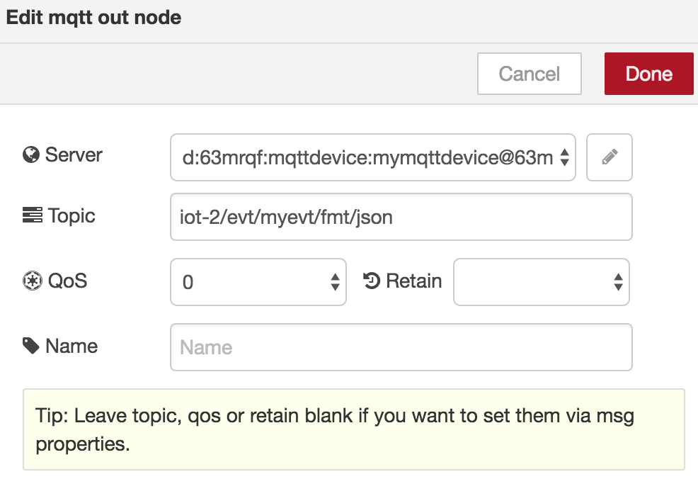

# Provision an IOT Service on Bluemix

1. Provision an IOT Platform service in Bluemix

1. Add a device based on a new or existing device type

1. Write down the generated token from this device and store into a file called device.json

  ```
  {
    "org": "You-Org-D",
    "id": "Your-Device-Id",
    "type": "Your-Device-Type",
    "auth-method": "token",
    "auth-token": "Your-Device-Token"
  }
  ```
  
# Call your IOT Service from a Node.js application

1. Create a node.js application with the following code

  ```
  var iotf = require("ibmiotf");
  var config = require("./device.json");

  var deviceClient = new iotf.IotfDevice(config);

  //setting the log level to debug. By default == 'warn'
  deviceClient.log.setLevel('debug');

  deviceClient.connect();

  deviceClient.on('connect', function () {
    var i = 0;
    console.log("connected");
    setInterval(function function_name() {
      i++;
      deviceClient.publish('myevt', 'json', '{"value":' + i + '}', 2);
    }, 2000);
  });
  ```
  
1. Run your application. You should see the following output:

  
  
1. Go to the Dashboard on IOT Platform on Bluemix. You should see the following result:


# Test your MQTT Broker with Node-RED

1. Provision a Node-RED service from the Bluemix catalog

1. Import the Node-RED flow *nodered-mqtt-flow.json*

1. You should see the following flow

  

1. Create a message payload as follows:

  

1. Configure the MQTT Broker node:

  

  The topic should be: ```iot-2/evt/myevt/fmt/json```

  
  
  The server should be: ```YOUR-ORG-ID.messaging.internetofthings.ibmcloud.com```
  The port should be:   ```8883``` for TLS
  The client id should: ```d:<your-org-id>:<your-device-type>:<your-device>```

1. Click on Inject node to simulate an event.

# Resources

For additional resources pay close attention to the following:

- [Node.js library for developing device and application clients for IBM IOT](https://www.npmjs.com/package/ibmiotf)